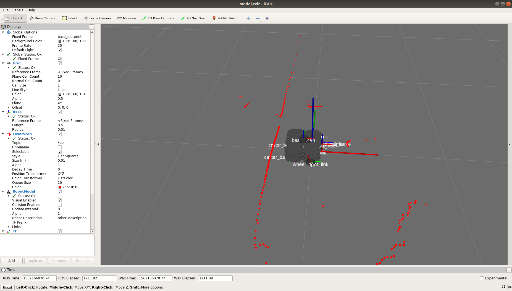

# turtlebot3-docker

Setup a docker container for the [Turtlebot3](http://emanual.robotis.com/docs/en/platform/turtlebot3/projects/) ROS master.  The container uses the host's network and the end-user should be aware that this may present [some security issues](https://www.cimcor.com/blog/the-top-5-security-risks-in-docker-container-deployment).

## FYI

* Commands with `[host]` are to be run on the host machine (where you are going to execute the docker commands)
* Commands with `[dckr]` are to be run in the docker container (running on the host machine)
* Commands with `[tb]` are to be run on the turtlebot

## Preliminaries

### Host machine
* [Install docker](https://docs.docker.com/get-started/)
* [Setup permissions for docker](https://docs.docker.com/install/linux/linux-postinstall/)
* `*` [Setup nvidia environment](http://wiki.ros.org/docker/Tutorials/Hardware%20Acceleration)
* [Enable port forwarding for X11](https://forums.docker.com/t/start-a-gui-application-as-root-in-a-ubuntu-container/17069)

`*`-only applies if you have an nvidia graphics card available for hardware acceleration.

Execute the following command to allow docker to do x11 forwarding:
```bash
[host] echo "xhost +local:docker" >> ~/.bashrc
```

_Crucial bit for networking to work:_
Add the following line to your `/etc/docker/daemon.json` file on the host:

```bash
"bridge": "none"
```

This disables docker's bridge network adapter which appears to mess with communication between the ros master and the pi.

### Turtlebot3
The raspberrypi setup follows the normal steps; see the [instructions](http://emanual.robotis.com/docs/en/platform/turtlebot3/sbc_setup/).

## Container on Host

_Note: the `intel` is provided as a reference only.  It should work as-is, but it has not been formally tested._

### Build
First, choose which image you want to build: `intel` or `nvidia`, then `symlink` it to `Dockerfile`.  For example, if you wish to use the `intel` version, do the following:

```bash
[host] ln -sf Dockerfile.intel Dockerfile
```

Finally, build the image:

```bash
[host] docker build --network=host -t turtlebot3-docker .
```

### Run

### Setting `ROS_MASTER_URI` on the Turtlebot3

Run the following and record the output: _Note: `wlp3s0` is a network device-id and may be different on your machine.  Look for your wireless network adapter id._

```bash
[host] ifconfig
```

Record the value under `inet` (it will look like 192.168.xxx.xxx) as `HOST_IP`.
Next, set the value in the Turtlebot:

```bash
[host] ssh pi@{pi_hostname}
[tb] ifconfig # record value as PI_IP
[tb] echo "ROS_MASTER_URI=http://{HOST_IP}:11311" >> ~/.bashrc
[tb] echo "ROS_HOSTNAME={PI_IP}" >> ~/.bashrc
```

### Run container (nvidia option)

_Note: the `intel` option follows similarly, just use `launch-docker-intel.sh` instead._

```bash
[host] launch-docker-nvidia.sh
```

It's a little kludgy, but to get another terminal open, do the following:

```bash
[host] docker exec -it {your_container_id} /bin/bash
```

`your_container_id` is the hash listed under the `PORTS` column associated with your running container.  _Note: I couldn't get the `NAMES` field to work correctly here._

You need two additional windows open on the `host` machine to follow along with the ROBOTIS demos.

## Test

You should now be able to follow all steps from [Turtlebot manual](http://emanual.robotis.com/docs/en/platform/turtlebot3/bringup/#bringup) and see an image like the following:



All steps marked for execution on the `REMOTE_PC` will be executed in the running docker container.

## Troubleshooting

* Make sure that the container and the pi have synchronized clocks.  Use [ntpdate](http://emanual.robotis.com/docs/en/platform/turtlebot3/faq/#faq) on _both_ the host and the pi to sync their clocks.  The `*.sh` run scripts forward the host's clock state to the container.
